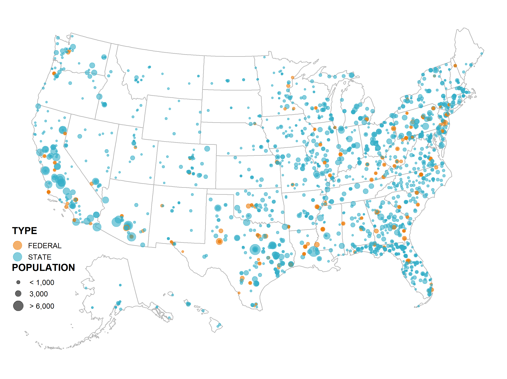

```{r setup, include=FALSE}
knitr::opts_chunk$set(echo = FALSE)
source("../setup.R")
```

## Summary of Potential Analysis: (that we have previously discussed)

### 1. Point Processes

In a general statistics sense, a point process is used to understand where specific points land, **and** predict where new points will land. In other words, we use point patterns when the most "important variable to be analyzed is the location of 'events'" (Cressie, 1993).

To illustrate, let us try to do this in the context of our problem. A point pattern/process would try to model where carceral facilities are built in a specific geographic region.

{width="500"}

What a point process would try to answer is why do these facilities appear on the grid the way they do? This is primarily done by assuming that their location is **random** and then attempting to model the location of their points and trying to predict where the next point is.

### 2. Geostatistical Regression Model

Geostatistics seeks to interpolate across a continuous surface to predict values at unmeasured locations based on some spatial autocorrelation. In much simpler terms, we are trying to predict an unobserved point across some space using the points around the points to learn something new.

One way to imagine geostatistics/a geo-statistical model is to model a wildfire. If we know the temperature of the fire at 5 specific points, geostatistics uses those spots to predict the temperature of the entire surrounding forest acknowledging that spots closer to the fire are hotter than those farther away.

### 3. Spatial Regression

A spatial regression model works in the way that we would expect--with one major caveat. In a typically regression model, we care what the relationship between a dependent (response) variable and independent (predictor) variable(s). The major caveat, is that we assume observations are not independent due to their spatial proximity.

Here, imagine we are trying to predict the house prices using the size of the house; however, we know that houses in specific neighborhoods are pricier regardless of size. In other words, the location of the house imposes some dependency structure on the price!

$$
\text{Price}_i = \beta_0+\beta_1*\text{House Size}_i + \epsilon_i(s)
$$

The perk of a model like this is that we could interpret the coefficients to tell us impact/effect of a specific constraint.

## Some Exploratory Data Analysis

```{r}
data <- read.csv("../outputs/final_df_2023-08-31.csv") %>% data.frame()

#summary(data)
```

## Questions/Concerns To Consider:

1.  How do we develop analysis that doesn't pit prisons against each other?
2.  "data are not neutral or objective. They are the products of unequal social relations, and this context is essential for conducting accurate, ethical analysis" (D'ignazio, Klein, 2020).
